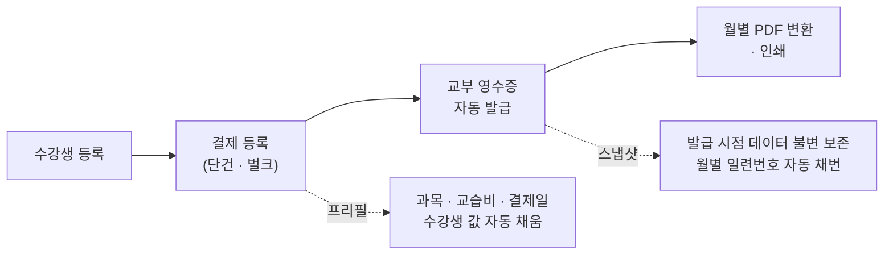
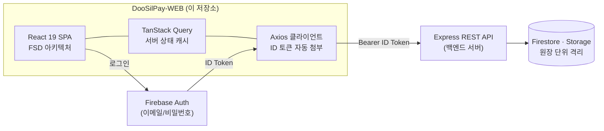
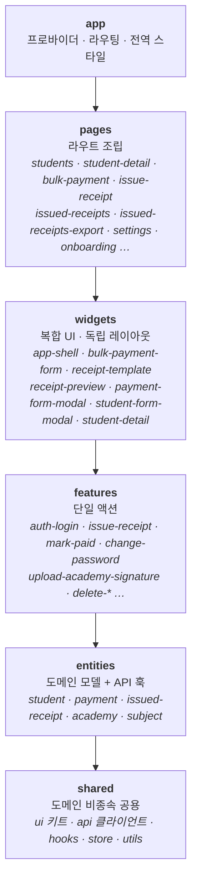

<div align="center">


# DooSilPay

**교습소·학원을 위한 수강료 결제 관리 · 교부 영수증 자동 발급 서비스 (Web)**

수강생 등록부터 결제 기록, 법정 서식 「교습비등 영수증 원부」 자동 발급, 월별 PDF 출력까지 —
학원 원장의 수납 업무를 한 곳에서 처리합니다.


</div>

---

## 소개

DooSilPay는 교습소·학원에서 매달 반복되는 **수강료 수납 업무**를 자동화하는 서비스입니다.
이 저장소는 그 **웹 프론트엔드**로, Firebase Auth로 인증하고 Express REST API 백엔드와 연동해 동작합니다.

수기·엑셀 관리에서 겪는 문제를 이렇게 해결합니다.

| 기존 방식의 문제 | DooSilPay |
|---|---|
| 매달 수십 명의 결제를 한 명씩 기록 | **벌크 결제 등록** — 스프레드시트처럼 한 화면에서 여러 행을 일괄 저장 |
| 법정 서식 영수증을 매번 수기로 작성 | 결제 데이터에서 필드 **자동 매핑** + 월별 일련번호 **자동 채번**으로 원클릭 발급 |
| 영수증 원부를 출력용으로 다시 정리 | 월별 발급분을 **A4 페이지에 잘림 없이 배치**해 바로 PDF 저장·인쇄 |
| 이번 달 누가 냈는지 파악 어려움 | 수강생 목록 상단 **이번 달 수납 현황**(완료 인원·수납액) 요약 |

---

## 핵심 기능

| 기능 | 설명 |
|---|---|
| 🧑‍🎓 **수강생 관리** | 등록/수정/비활성화, 등록번호 자동 부여, 이름·과목 검색, 대표 과목·기본 교습비·매월 결제일 보유(결제 등록 시 프리필) |
| 💳 **결제 관리** | 연월(period) 단위 결제 기록 CRUD, 납부 상태(예정/납부완료/미납) 수동 관리, 기타경비 다항목, 납부 완료 처리 |
| 📋 **벌크 결제 등록** | 대상 연월을 한 번 선택하고 여러 행을 추가·복제하며 일괄 저장. 행 단위 검증 후 통과분만 저장 |
| 🧾 **교부 영수증 자동 발급** | 「교습비등 영수증 원부」를 결제 1건 → 버튼 한 번으로 발급. 월별 `YYYY-MM-NNN` 자동 채번, **발급 시점 스냅샷 저장**(이후 수강생 정보가 바뀌어도 발급본 불변), 삭제 시 동월 일련번호 재정렬 |
| 🖨️ **월별 PDF 변환** | 월 선택 → 대상 체크 → A4 **2×2 배치 미리보기** → 브라우저 인쇄로 PDF 저장. 서식이 페이지 경계에서 잘리지 않도록 블록 단위 배치 |
| 🏫 **학원 정보 설정** | 발급 주체(상호·대표자·연락처) 관리, 교습과목 관리, **서명/인 이미지 업로드** |
| 🔐 **인증·온보딩** | 발급제 계정(회원가입 없음) 이메일 로그인, 첫 로그인 시 임시 비밀번호 재설정 + 학원 기초 정보 입력 온보딩 |

### 메인 흐름



---

## 화면 · 라우트

| 경로 | 화면 | 인증 |
|---|---|:---:|
| `/login` | 로그인 | ✗ |
| `/onboarding/academy` | 온보딩 — 비밀번호 재설정 + 학원 정보 입력 | ✓ |
| `/students` | 수강생 목록 + 이번 달 수납 현황 (홈) | ✓ |
| `/students/:id` | 수강생 상세 + 결제 이력 | ✓ |
| `/payments/bulk` | 벌크 결제 등록 | ✓ |
| `/payments/:paymentId/issue` | 교부 영수증 발급 폼 + 실시간 미리보기 | ✓ |
| `/issued-receipts` | 교부 영수증 목록 (월 필터·미리보기·삭제) | ✓ |
| `/issued-receipts/export` | 월별 PDF 변환 (A4 배치 미리보기 → 인쇄) | ✓ |
| `/settings/academy` | 학원 정보·과목·계정 설정 | ✓ |
| `/settings/signatures` | 서명 관리 | ✓ |

라우팅 가드(`ProtectedRoute`)가 미인증 접근은 `/login`으로, 인증됐지만 학원 정보가 아직 없는 계정은 `/onboarding/academy`로 강제 이동시킵니다.
레이아웃은 반응형으로, 데스크탑에서는 사이드바, 모바일에서는 하단 탭 내비게이션을 사용합니다.

---

## 시스템 아키텍처



- **인증**: 클라이언트의 Firebase SDK는 **Auth 전용**입니다. Axios 요청 인터셉터가 모든 API 호출에 Firebase ID 토큰을 `Authorization: Bearer`로 자동 첨부합니다. (`src/shared/api/http/httpClient.ts`)
- **데이터**: 모든 도메인 데이터(수강생·결제·영수증·학원 정보)는 Express REST API를 경유합니다. 응답은 `APIResponse<T>` 공통 envelope로 감싸집니다.
- **파일 업로드**: 서명 이미지는 **presigned URL 패턴**으로 처리합니다 — 백엔드에서 업로드 URL 발급 → 스토리지에 직접 `PUT` → 백엔드에 확정(confirm) 요청.
- **멀티테넌트**: 계정 = 학원 원장. 모든 데이터는 원장 단위로 격리되어 다른 원장의 데이터에 접근할 수 없습니다.
- **PDF**: 별도 라이브러리 없이 서식을 HTML/CSS로 1:1 재현하고, A4 고정 배치 + 인쇄 전용 스타일로 `window.print()`를 사용해 PDF 저장·인쇄를 처리합니다.

---

## 프론트엔드 아키텍처 — FSD (Feature-Sliced Design)

레이어 간 **단방향 의존**(`app → pages → widgets → features → entities → shared`)을 강제하고,
모든 슬라이스는 `index.ts` 배럴로만 공개 API를 노출합니다(딥 임포트 금지).



| 레이어 | 역할 | 대표 슬라이스 |
|---|---|---|
| `app` | 프로바이더(Auth·Query)·라우팅·가드·전역 스타일 | `providers`, `routing`, `styles` |
| `pages` | 라우트 단위 화면 조립 | `students`, `bulk-payment`, `issued-receipts-export`, `onboarding` |
| `widgets` | 복합 UI·독립 레이아웃 | `app-shell`, `bulk-payment-form`, `receipt-template`, `receipt-preview` |
| `features` | 단일 사용자 액션 | `auth-login`, `issue-receipt`, `mark-paid`, `change-password` |
| `entities` | 도메인 모델·API 훅·도메인 UI | `student`, `payment`, `issued-receipt`, `academy`, `subject` |
| `shared` | 도메인 비종속 공용 코드 | `ui`(20여 컴포넌트 + 아이콘 세트), `api`, `hooks`, `store`, `utils` |

```
src/
├── app/          # 부트스트랩 — AuthProvider · QueryProvider · router · ProtectedRoute
├── pages/        # 라우트 화면 (슬라이스별 ui 세그먼트)
├── widgets/      # 복합 UI 블록
├── features/     # 단일 액션 (ui · hooks · api · model)
├── entities/     # 도메인 (api: TanStack Query 훅 · model: 타입 · ui · utils)
└── shared/       # UI 키트 · http/firebase 클라이언트 · 공용 훅 · Zustand 스토어 · 유틸
```

경로 별칭은 레이어별로 제공됩니다: `@app/*` `@pages/*` `@widgets/*` `@features/*` `@entities/*` `@shared/*`
(tsconfig `paths` 단일 출처, `vite-tsconfig-paths`로 Vite·Vitest에서 재사용)

---

## 기술 스택

| 분류 | 사용 기술 |
|---|---|
| 코어 | React 19 · TypeScript 6 · Vite 8 |
| 라우팅 | React Router 7 (`createBrowserRouter`) |
| 서버 상태 | TanStack Query 5 — `useSuspenseQuery` 기반, `AsyncBoundary`(Suspense + ErrorBoundary) + Skeleton 로딩 |
| 클라이언트 상태 | Zustand 5 (`useUiStore`, `useToastStore`) |
| 폼 | React Hook Form 7 |
| 스타일 | Tailwind CSS 4 — CSS `@theme` 디자인 토큰 · Pretendard Variable |
| 애니메이션 | Motion 12 (사이드바 스프링 전환, `prefers-reduced-motion` 대응) |
| HTTP·인증 | Axios + Firebase Auth 12 (ID 토큰 인터셉터) |
| 테스트 | Vitest 4 · Testing Library (React 16 · user-event · jest-dom) · jsdom |
| 컴포넌트 문서 | Storybook 10 (react-vite · addon-docs) |
| 코드 품질 | ESLint 10 (flat config · typescript-eslint · react-hooks) · Prettier 3 (import 자동 정렬) |
| 환경 | Node 20 · pnpm 9 · Vercel (SPA rewrite) |

### 디자인 시스템 메모

- **`1rem = 10px`** — `html { font-size: 62.5% }` 루트에서 모든 치수를 rem으로 직접 명시합니다 (`text-[1.4rem]`, `gap-[1rem]`). Tailwind 기본 스케일 유틸은 사용하지 않습니다.
- 색·라운드·섀도는 `@theme` **시맨틱 토큰**으로 관리합니다 (`bg-point`, `text-ink`, `rounded-md`, `shadow-md` — 브랜드 컬러는 oklch 기반).
- 금액·번호 표기는 `tabular-nums`로 자릿수를 정렬합니다.

---

## 시작하기

### 요구 사항

- Node.js **20.x**
- pnpm **9.x**
- 실행 중인 **DooSilPay 백엔드**(Express REST API · 별도 저장소) 및 Firebase 프로젝트(Auth)

### 설치 · 실행

```bash
pnpm install
cp .env.example .env.local   # 환경변수 채우기 (.env.example 참고)
pnpm dev                     # http://localhost:5173
```

### 스크립트

| 명령 | 설명 |
|---|---|
| `pnpm dev` | Vite 개발 서버 |
| `pnpm build` | 타입체크(`tsc -b`) + 프로덕션 빌드 |
| `pnpm preview` | 빌드 결과 로컬 미리보기 |
| `pnpm test` | Vitest 단위 테스트 (watch) |
| `pnpm lint` / `pnpm lint:fix` | ESLint 검사 / 자동 수정 |
| `pnpm format` / `pnpm format:check` | Prettier 포맷 / 검사 |
| `pnpm storybook` | Storybook 개발 서버 (`:6006`) |
| `pnpm build-storybook` | Storybook 정적 빌드 |

---

## 품질 관리

- **단위 테스트 55개 파일** — 훅·유틸·컴포넌트 옆에 콜로케이트(`*.test.ts(x)`). 파일 검증, 폼 로직, 포맷터, API 에러 매핑 등 동작 단위로 검증합니다.
- **Storybook 스토리 48개 파일** — shared UI 키트부터 벌크 결제 폼·영수증 템플릿 같은 도메인 위젯까지 문서화합니다.
- ESLint(flat config) + Prettier(import 정렬 포함)를 커밋 전 통과 기준으로 사용합니다.

## 배포

Vercel에 SPA로 배포합니다. `vercel.json`의 rewrite 설정이 모든 경로를 `index.html`로 돌려 React Router가 클라이언트 라우팅을 처리합니다.
